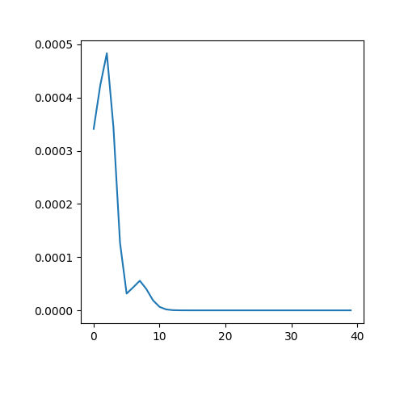

# PageRank algorithm using Spark
The PageRank Algorithm is developed here using spark (pyspark)

---

## How to run the app:
run the app by `python myPageRank.py`   

---

the PageRank algorithm is tested using the data "graph" that is in the same directory as the main file  
results will be saved in `resultall.txt` that contains the rank of each node of the graph.  
the error at each iteration, which shows the convergence of the algorithm, is plotted as:  

