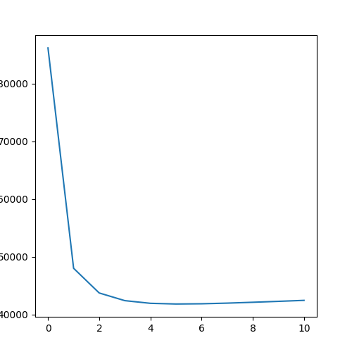
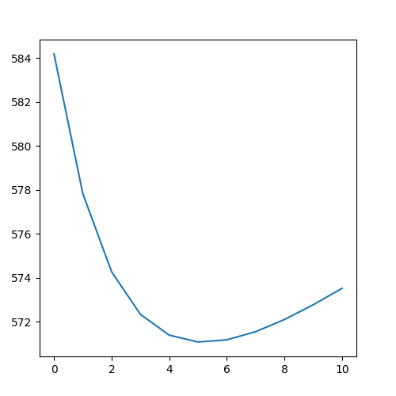

# Ridge Regression using Spark
Generating a regression model on a dataset using pyspark

---

## How to run the app:
run the algorithm by `python run.py`   

This python file runs the file `ParallelRegression.py` for different values of regression parameters and chooses the best hyperparameter that has the least error on the test dataset.

This script also plots two seperate plots for each dataset {(big.test,big.train) , (small.test,small.train)} as below:  

              error  
  
               regularization factor  

               error   
   
              regularization factor 